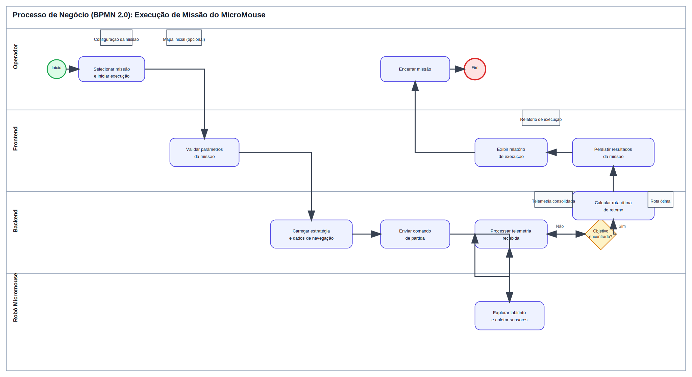

# Diagrama BPMN

## Processo modelado (Capítulo 4)

O diagrama abaixo representa o **fluxo principal de sucesso (Happy Path)** do software do projeto MicroMouse, desde o início da missão até a geração do relatório final.

## Fluxo principal de sucesso (Happy Path)

1. O **Operador** inicia uma missão na interface.
2. O **Frontend** valida os parâmetros informados.
3. O **Backend** carrega estratégia e dados de navegação.
4. O **Backend** envia o comando de partida ao robô.
5. O **Robô Micromouse** explora o labirinto e envia telemetria.
6. O **Backend** processa leituras e verifica se o objetivo foi encontrado.
7. Ao encontrar o objetivo, o **Backend** calcula a rota ótima de retorno.
8. O **Backend** persiste os resultados da execução.
9. O **Frontend** apresenta o relatório ao operador.
10. O processo é encerrado com sucesso.

## Objetos de dados (Insumos e Resultados)

| Tipo | Objeto de dados | Papel no processo |
| :-- | :-- | :-- |
| Insumo | Configuração da missão | Parâmetros iniciais definidos pelo operador (modo, limite de tempo, estratégia). |
| Insumo | Mapa inicial (opcional) | Referência para apoiar a navegação, quando disponível. |
| Resultado | Telemetria consolidada | Leituras de sensores e estado do robô processados durante a execução. |
| Resultado | Rota ótima | Melhor caminho identificado após a detecção do objetivo. |
| Resultado | Relatório de execução | Visão final apresentada ao operador para análise da missão. |

## Papel de cada ator no diagrama

- **Operador:** inicia e finaliza a missão, além de consumir o resultado final.
- **Frontend (Interface):** recebe a solicitação do operador, valida entradas e exibe resultados.
- **Backend (Controle):** coordena a execução, processa telemetria, aplica regras e persistência.
- **Robô Micromouse:** executa o deslocamento no labirinto e coleta dados de sensores em tempo real.

## Elementos BPMN mapeados

- **Evento de início:** abertura da missão pelo operador.
- **Tarefas de usuário/serviço:** validação, envio de comandos, exploração, processamento e relatório.
- **Gateway exclusivo:** decisão “Objetivo encontrado?” para controle do loop de exploração.
- **Evento de fim:** missão concluída e resultados entregues.
- **Objetos de dados:** insumos e resultados explícitos no fluxo para rastreabilidade.
